# ☁️ Azure CloudStart GmbH – Mini Project


<a name="top"></a>
### 🌐 Choose your language / Wähle deine Sprache

<div align="center">

### [**Read in English**](#english) &nbsp;&nbsp;|&nbsp;&nbsp; [**Auf Deutsch lesen**](#deutsch)

</div>

---
---

<a name="english"></a>
# English

## 📖 About this project

**CloudStart GmbH** is a fictional startup based in Vienna 🇦🇹 that just decided to move its entire IT infrastructure to the cloud. As the new Cloud Administrator, I (Emre) built a clean Azure environment for them — step by step, with security and best practices in mind.

📌 This is a **solo training project**, built as part of my Azure Weiterbildung at **DCI (Digital Career Institute)** in Germany.

---

## 🏢 The Scenario

| 🏷️ | Detail |
|---|---|
| 🏢 Company | CloudStart GmbH |
| 📍 Location | Vienna, Austria |
| 🌍 Azure Region | Sweden Central |
| 📦 Resource Group | `rg-cloudstart` |
| 👥 Employees | 3 fictional users with different access levels |

The goal: build a small but realistic company IT setup in Azure — with proper network segmentation, role-based access (RBAC), monitoring, and security checks.

---

## 🗺️ Architecture Overview

```
📦 rg-cloudstart
 ┣ 🌐 vnet-cloudstart (10.0.0.0/16)
 ┃  ┣ 🟦 snet-app (10.0.1.0/24)   → 🛡️ nsg-app  → 🖥️ vm-app01 (Windows)
 ┃  ┗ 🟩 snet-mgmt (10.0.2.0/24)  → 🛡️ nsg-mgmt → 🐧 vm-mgmt01 (Linux)
 ┣ 🗄️ Storage Account → 📁 Blob Container "dokumente"
 ┣ 👤 Microsoft Entra ID → Users + Group + RBAC
 ┣ 📊 Azure Monitor → CPU Alert
 ┣ 🛡️ Microsoft Defender for Cloud → Secure Score + Recommendations
 ┗ 🌍 App Service → Web App
```

📐 Visual diagram:

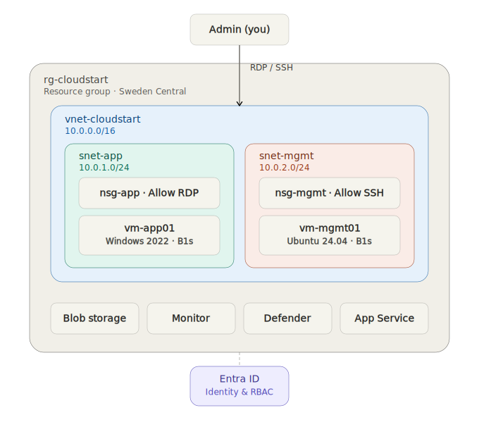

---

## 🔧 What I built

### 1️⃣ Network Foundation 🌐
Created a Virtual Network with two separate subnets — one for applications, one for management — each protected by its own Network Security Group (NSG).

- ✅ VNet `vnet-cloudstart` (10.0.0.0/16)
- ✅ Subnet `snet-app` + NSG with RDP rule
- ✅ Subnet `snet-mgmt` + NSG with SSH rule

📸
| nsg-app — Inbound Rules | nsg-mgmt — Inbound Rules |
|---|---|
| 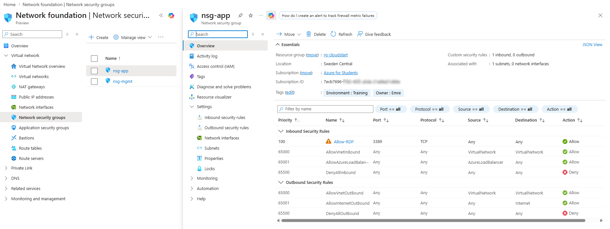 | 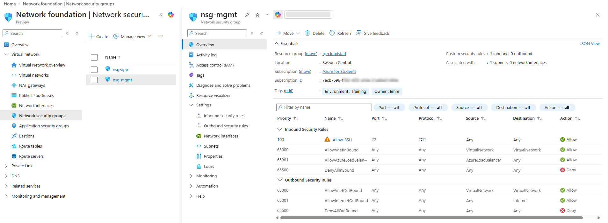 |

---

### 2️⃣ Virtual Machines 🖥️🐧
Deployed one Windows Server VM and one Linux (Ubuntu) VM, each in its correct subnet. Connected to both via RDP and SSH.

- ✅ `vm-app01` — Windows Server 2022 (B1s)
- ✅ `vm-mgmt01` — Ubuntu Server 24.04 (B1s)

📸
| RDP → Server Manager (vm-app01) | SSH → uname -a (vm-mgmt01) |
|---|---|
| 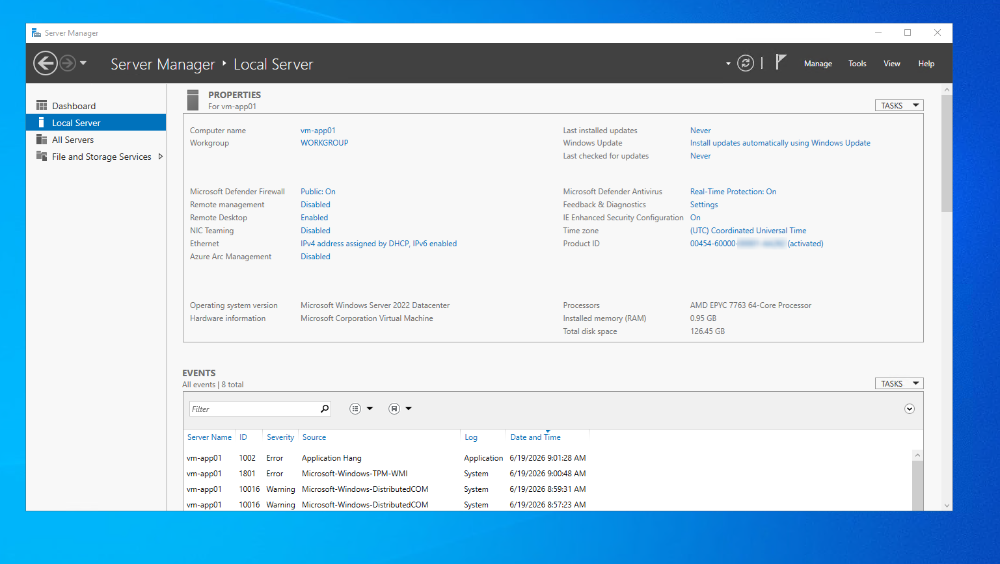 | 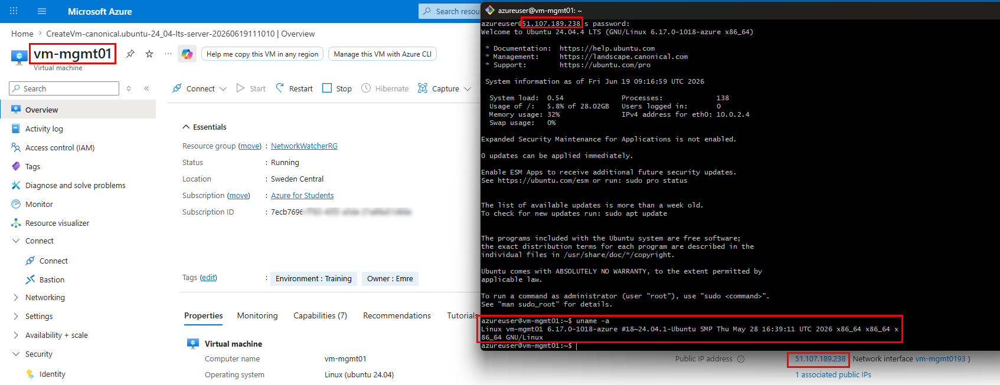 |

---

### 3️⃣ Storage & Blob 🗄️
Set up a Storage Account with a private Blob Container, uploaded a test file, and generated a temporary secure link (SAS URL) to access it.

- ✅ Storage Account `stcloudstartmr`
- ✅ Private Blob Container `dokumente`
- ✅ SAS URL (1 hour validity)

📸
| Blob Container (Private) | SAS URL opened in browser |
|---|---|
| 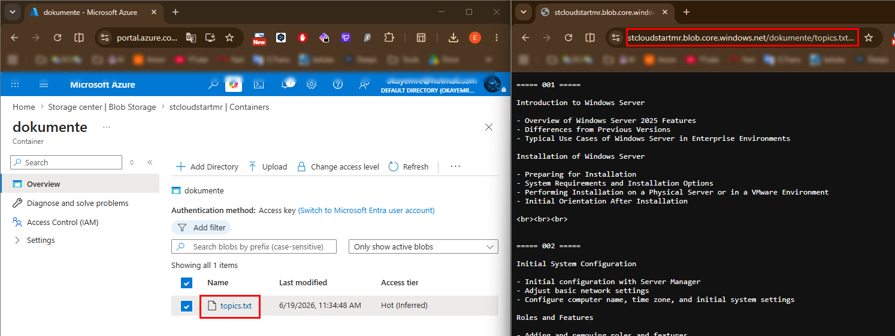 | 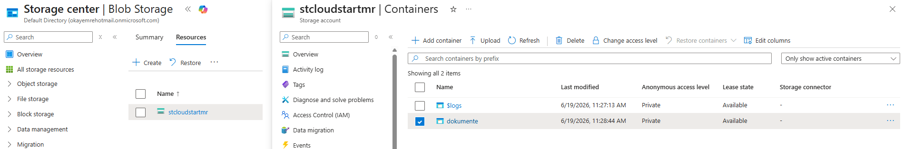 |

---

### 4️⃣ Identity & Access (Entra ID + RBAC) 👤🔐
Created 3 fictional users in Microsoft Entra ID, grouped them, and assigned **least-privilege** access using RBAC roles.

| 👤 User | 🎭 Role | 🔑 Access |
|---|---|---|
| Anna Maier | CEO | Reader (read-only) |
| Ben Koller | Developer | VM Contributor (via group) |
| Clara Fuchs | Intern | No Azure access |

- ✅ Security Group `grp-entwickler`
- ✅ RBAC roles assigned on Resource Group level

📸
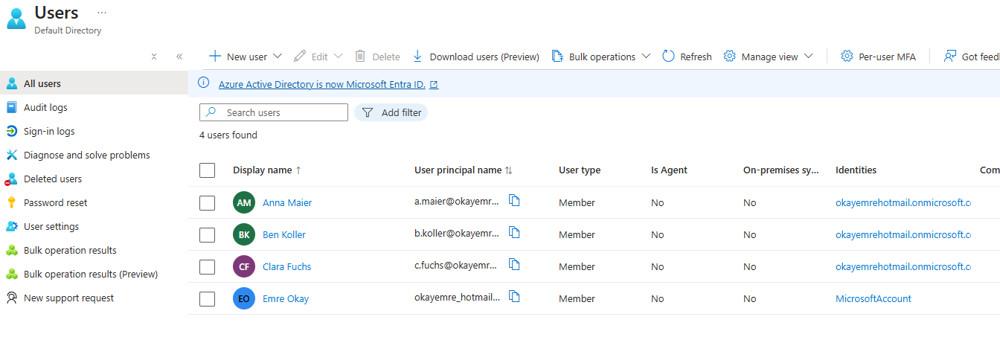

| Group Members (grp-entwickler) | RBAC Role Assignments |
|---|---|
| 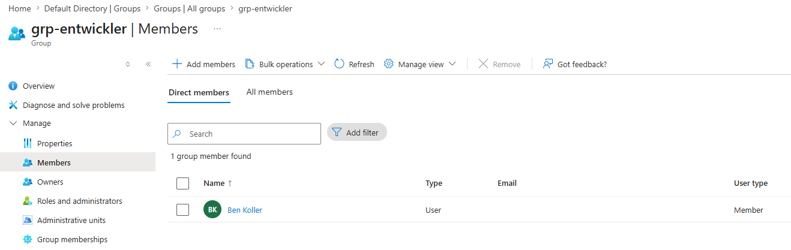 | 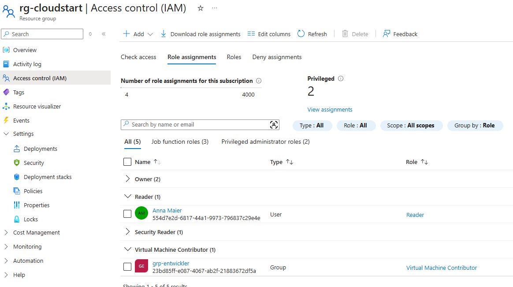 |

---

### 5️⃣ Monitoring 📊
Set up basic monitoring on the VM with a CPU metric chart and an alert rule that triggers an email if CPU usage gets too high.

- ✅ CPU metric chart (last hour)
- ✅ Alert Rule `alert-cpu-hoch` (>80% CPU → email, Severity 2)

📸
| CPU Metric Chart | Alert Rule Configuration |
|---|---|
| 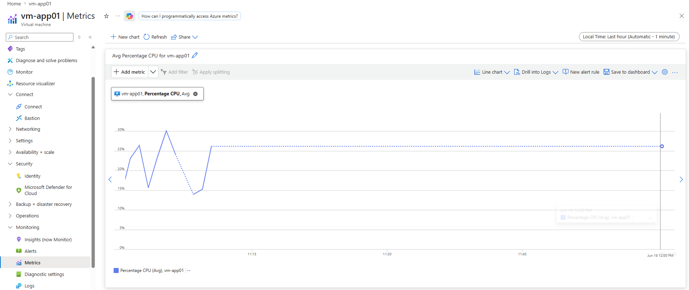 | 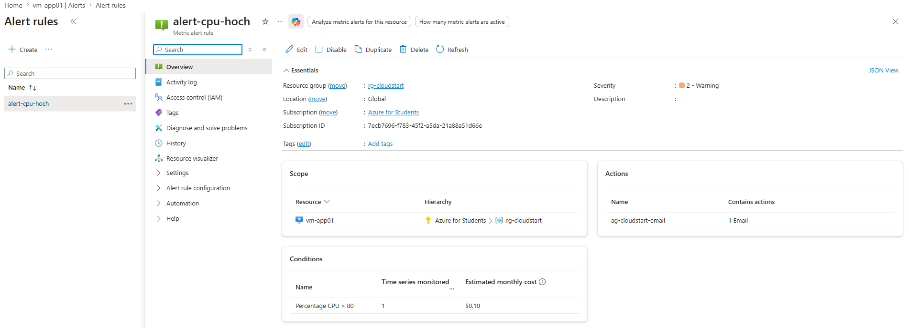 |

---

### 6️⃣ Security Check (Defender for Cloud) 🛡️
Reviewed the **Secure Score** and security recommendations in Microsoft Defender for Cloud (Foundational CSPM, free tier). Found and fixed a real security gap — the open RDP rule that was intentionally left as "Any" in A1 was detected and restricted to a specific IP.

- ✅ Secure Score reviewed (**31%**)
- ✅ Recommendations filtered for `rg-cloudstart` (9 findings across `vm-app01` and `stcloudstartmr`)
- ✅ "Management ports should be closed" recommendation reviewed and applied
- ✅ `nsg-app` → `Allow-RDP` rule: Source changed from `Any` → own IP address (`/32`)

> 💡 **Before:** RDP port open to the entire internet (`Any`)
> 💡 **After:** RDP port restricted to a single trusted IP address

> ⚠️ **Lesson learned:** Defender for Cloud's recommendation engine can take several hours (sometimes up to 24h) to fully index brand-new resources, even when the plan itself is active immediately. Planning security reviews a day after resource creation avoids this gap.

📸
| Secure Score | Recommendations list |
|---|---|
| 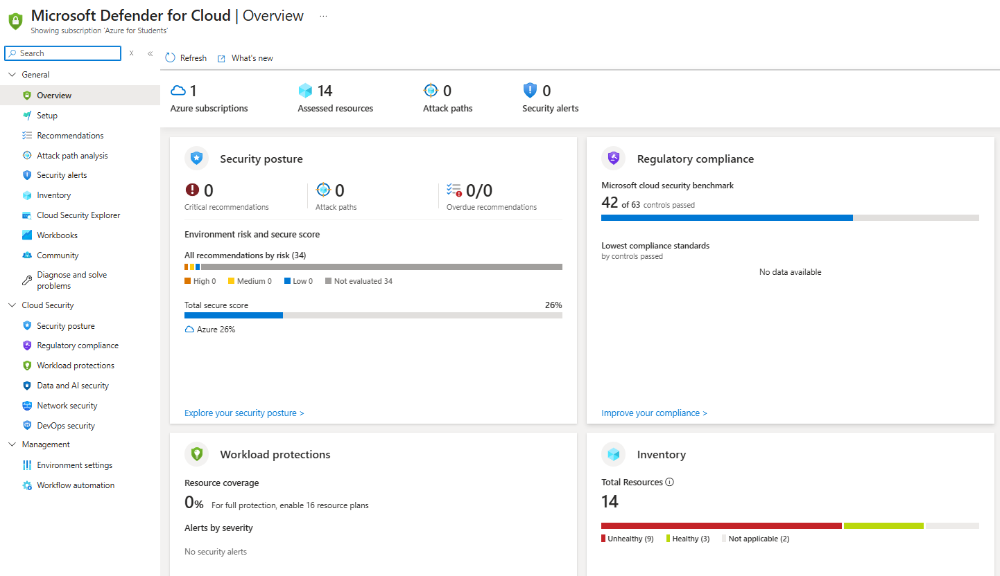 | 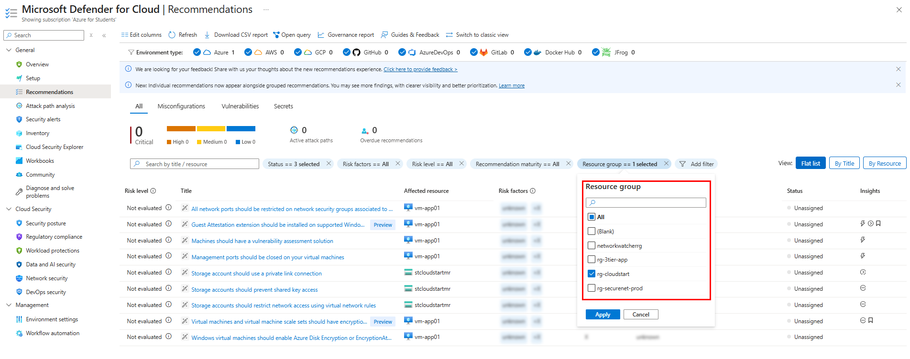 |

| Management ports recommendation | NSG RDP rule fixed |
|---|---|
| 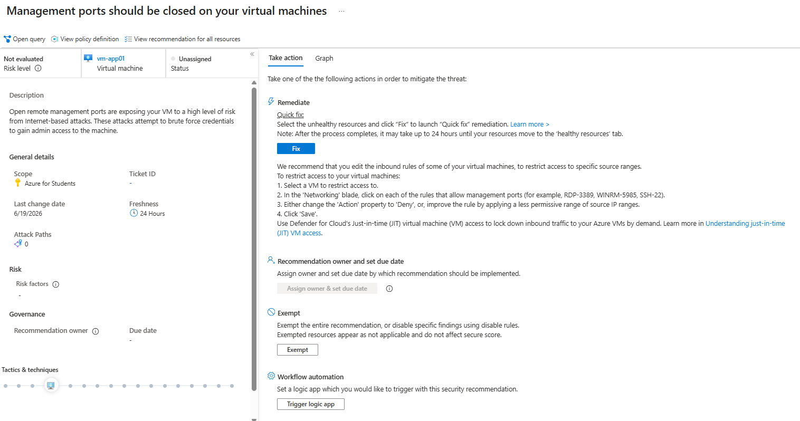 | 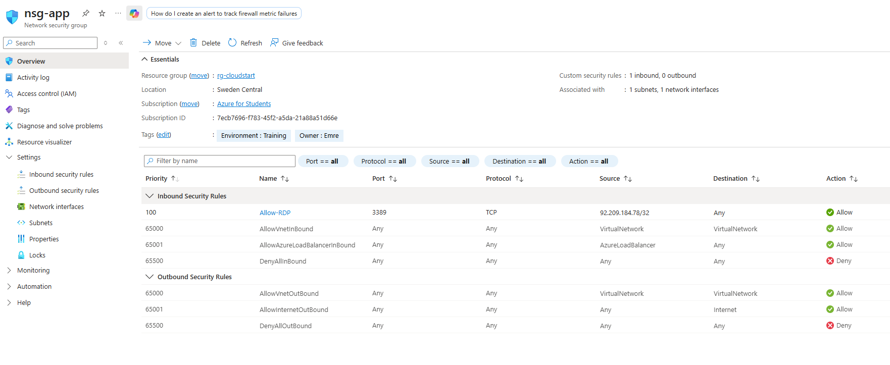 |

---

### ⭐ App Service 🌍
Deployed a Web App on a free App Service Plan (F1 tier) to test PaaS deployment.

- ✅ App Service Plan `asp-cloudstart` (F1 Free)
- ✅ Web App `app-cloudstart-mr`
- ✅ Application Setting `UMGEBUNG = Test`

📸
| Web App running | Application Setting |
|---|---|
| 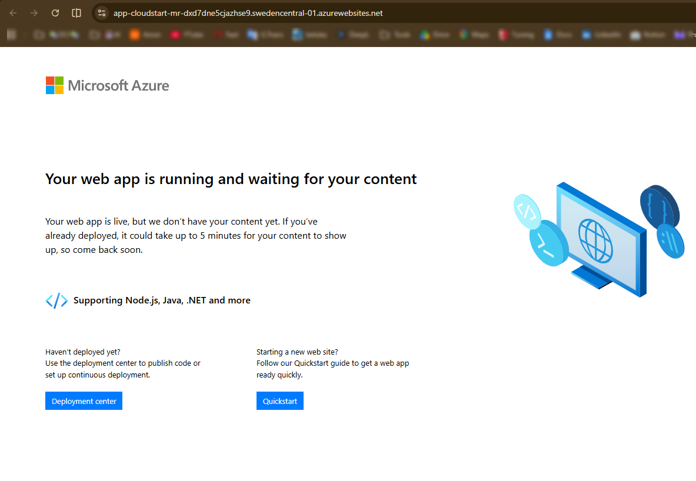 | 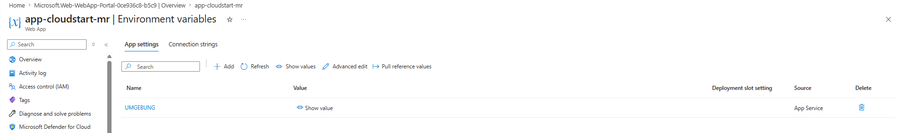 |

> 💡 **Debugging note:** The first deployment attempt (Windows + Node 24 LTS runtime) failed with *"64 Bit worker processes cannot be used... as the plan does not allow it"* — Node 24 LTS requires a 64-bit worker process on Windows, which the F1 (Free) tier doesn't support. Switching the runtime stack to **.NET** resolved it immediately, since .NET on Windows F1 defaults to a compatible 32-bit worker process.

---

## 🏷️ Tagging Strategy

All resources are tagged consistently for clarity and cost tracking — good cloud hygiene, even in a training project.

| Tag | Value |
|---|---|
| `Project` | CloudStart-MiniProject |
| `Environment` | Training |
| `Owner` | Emre |
| `CostCenter` | Student-Credit |
| `ManagedBy` | Manual |
| `DeleteAfter` | 2026-06-30 |

---

## 🛠️ Azure Services Used

| Category | Service |
|---|---|
| 🌐 Networking | Virtual Network, Subnets, NSGs |
| 🖥️ Compute | Virtual Machines (Windows & Linux) |
| 🗄️ Storage | Storage Account, Blob Container, SAS |
| 👤 Identity | Microsoft Entra ID, RBAC |
| 📊 Monitoring | Azure Monitor, Alert Rules |
| 🛡️ Security | Microsoft Defender for Cloud |
| 🌍 PaaS | App Service |

---

## 💰 Cost Note

This project was built within the limits of an Azure for Students subscription. Cheapest VM sizes (B1s) and free-tier services (F1 App Service) were used wherever possible. All resources were deleted after project completion to save credit.

---

## 📂 Repository Structure

```
azure-cloudstart-miniproject/
├── README.md
├── .gitignore
├── screenshots/
│   ├── a1-network/
│   ├── a2-vms/
│   ├── a3-storage/
│   ├── a4-entra-rbac/
│   ├── a5-monitoring/
│   ├── a6-defender/
│   └── bonus-appservice/
└── docs/
    └── architecture-diagram.svg
```

<div align="right">

[⬆️ Back to language selector](#top)

</div>

---
---

<a name="deutsch"></a>
# Deutsch

## 📖 Über dieses Projekt

**CloudStart GmbH** ist ein fiktives Startup aus Wien 🇦🇹, das seine komplette IT in die Cloud verlagert. Als neuer Cloud-Administrator habe ich (Emre) für sie eine saubere Azure-Umgebung aufgebaut – Schritt für Schritt, mit Fokus auf Sicherheit und Best Practices.

📌 Dies ist ein **Solo-Trainingsprojekt**, entstanden im Rahmen meiner Azure-Weiterbildung am **DCI (Digital Career Institute)** in Deutschland.

---

## 🏢 Das Szenario

| 🏷️ | Detail |
|---|---|
| 🏢 Firma | CloudStart GmbH |
| 📍 Standort | Wien, Österreich |
| 🌍 Azure Region | Sweden Central |
| 📦 Resource Group | `rg-cloudstart` |
| 👥 Mitarbeiter | 3 fiktive Benutzer mit unterschiedlichen Zugriffsrechten |

Das Ziel: ein kleines, aber realistisches Firmen-IT-Setup in Azure aufbauen – mit sauberer Netzwerk-Trennung, rollenbasiertem Zugriff (RBAC), Monitoring und Sicherheitschecks.

---

## 🗺️ Architektur-Übersicht

```
📦 rg-cloudstart
 ┣ 🌐 vnet-cloudstart (10.0.0.0/16)
 ┃  ┣ 🟦 snet-app (10.0.1.0/24)   → 🛡️ nsg-app  → 🖥️ vm-app01 (Windows)
 ┃  ┗ 🟩 snet-mgmt (10.0.2.0/24)  → 🛡️ nsg-mgmt → 🐧 vm-mgmt01 (Linux)
 ┣ 🗄️ Storage Account → 📁 Blob Container "dokumente"
 ┣ 👤 Microsoft Entra ID → Users + Group + RBAC
 ┣ 📊 Azure Monitor → CPU Alert
 ┣ 🛡️ Microsoft Defender for Cloud → Secure Score + Empfehlungen
 ┗ 🌍 App Service → Web App
```

📐 Visuelles Diagramm:


---

## 🔧 Was ich gebaut habe

### 1️⃣ Netzwerk-Grundlage 🌐
Virtual Network mit zwei getrennten Subnetzen erstellt — eines für Anwendungen, eines für Verwaltung — jeweils mit eigener Network Security Group (NSG) geschützt.

- ✅ VNet `vnet-cloudstart` (10.0.0.0/16)
- ✅ Subnet `snet-app` + NSG mit RDP-Regel
- ✅ Subnet `snet-mgmt` + NSG mit SSH-Regel

📸
| nsg-app — Inbound Rules | nsg-mgmt — Inbound Rules |
|---|---|
|  |  |

---

### 2️⃣ Virtuelle Maschinen 🖥️🐧
Eine Windows Server VM und eine Linux (Ubuntu) VM bereitgestellt, jeweils im richtigen Subnetz. Verbindung per RDP und SSH erfolgreich getestet.

- ✅ `vm-app01` — Windows Server 2022 (B1s)
- ✅ `vm-mgmt01` — Ubuntu Server 24.04 (B1s)

📸
| RDP → Server Manager (vm-app01) | SSH → uname -a (vm-mgmt01) |
|---|---|
|  |  |

---

### 3️⃣ Storage & Blob 🗄️
Storage Account mit privatem Blob Container eingerichtet, Testdatei hochgeladen und einen temporären sicheren Link (SAS URL) für den Zugriff erstellt.

- ✅ Storage Account `stcloudstartmr`
- ✅ Privater Blob Container `dokumente`
- ✅ SAS URL (1 Stunde gültig)

📸
| Blob Container (Privat) | SAS URL im Browser geöffnet |
|---|---|
|  |  |

---

### 4️⃣ Identity & Zugriff (Entra ID + RBAC) 👤🔐
3 fiktive Benutzer in Microsoft Entra ID erstellt, gruppiert und Zugriff nach dem **Least-Privilege-Prinzip** über RBAC-Rollen vergeben.

| 👤 Benutzer | 🎭 Rolle | 🔑 Zugriff |
|---|---|---|
| Anna Maier | Geschäftsführerin | Reader (nur Lesezugriff) |
| Ben Koller | Entwickler | VM Contributor (über Gruppe) |
| Clara Fuchs | Praktikantin | Kein Azure-Zugriff |

- ✅ Sicherheitsgruppe `grp-entwickler`
- ✅ RBAC-Rollen auf Resource-Group-Ebene zugewiesen

📸


| Gruppenmitglieder (grp-entwickler) | RBAC-Rollenzuweisungen |
|---|---|
|  |  |

---

### 5️⃣ Monitoring 📊
Basis-Monitoring auf der VM eingerichtet — CPU-Metrik-Diagramm plus Alert-Regel, die bei zu hoher CPU-Auslastung eine E-Mail auslöst.

- ✅ CPU-Metrik-Diagramm (letzte Stunde)
- ✅ Alert Rule `alert-cpu-hoch` (>80% CPU → E-Mail, Severity 2)

📸
| CPU-Metrik-Diagramm | Alert Rule Konfiguration |
|---|---|
|  |  |

---

### 6️⃣ Sicherheitscheck (Defender for Cloud) 🛡️
**Secure Score** und Sicherheitsempfehlungen in Microsoft Defender for Cloud überprüft (Foundational CSPM, kostenloser Tier). Eine echte Sicherheitslücke gefunden und behoben — die in A1 absichtlich offen gelassene RDP-Regel wurde von Defender erkannt und auf eine konkrete IP-Adresse eingeschränkt.

- ✅ Secure Score überprüft (**31%**)
- ✅ Empfehlungen für `rg-cloudstart` gefiltert (9 Findings für `vm-app01` und `stcloudstartmr`)
- ✅ Empfehlung "Management ports should be closed" geprüft und umgesetzt
- ✅ `nsg-app` → `Allow-RDP`: Source von `Any` → eigene IP-Adresse (`/32`) geändert

> 💡 **Vorher:** RDP-Port für das gesamte Internet offen (`Any`)
> 💡 **Nachher:** RDP-Port auf eine einzige vertrauenswürdige IP-Adresse eingeschränkt

> ⚠️ **Erkenntnis:** Defender for Cloud's Empfehlungs-Engine kann mehrere Stunden (manchmal bis zu 24h) brauchen, um brandneue Ressourcen vollständig zu indexieren — auch wenn der Plan selbst sofort aktiv ist. Sicherheitsüberprüfungen einen Tag nach der Ressourcenerstellung einzuplanen, vermeidet diese Lücke.

📸
| Secure Score | Empfehlungsliste |
|---|---|
|  |  |

| Management Ports Empfehlung | NSG RDP-Regel behoben |
|---|---|
|  |  |

---

### ⭐ App Service 🌍
Eine Web App auf einem kostenlosen App Service Plan (F1 Tier) bereitgestellt, um PaaS-Deployment zu testen.

- ✅ App Service Plan `asp-cloudstart` (F1 Free)
- ✅ Web App `app-cloudstart-mr`
- ✅ Application Setting `UMGEBUNG = Test`

📸
| Web App läuft | Application Setting |
|---|---|
|  |  |

> 💡 **Debugging-Hinweis:** Der erste Deployment-Versuch (Windows + Node 24 LTS Runtime) schlug fehl mit *"64 Bit worker processes cannot be used... as the plan does not allow it"* — Node 24 LTS benötigt unter Windows einen 64-Bit-Worker-Prozess, den der F1-(Free)-Tier nicht unterstützt. Der Wechsel der Runtime auf **.NET** löste das Problem sofort, da .NET unter Windows F1 standardmäßig einen kompatiblen 32-Bit-Worker-Prozess verwendet.

---

## 🏷️ Tag-Strategie

Alle Ressourcen sind einheitlich getaggt — für Übersicht und Kostenkontrolle, gute Cloud-Hygiene auch im Trainingsprojekt.

| Tag | Wert |
|---|---|
| `Project` | CloudStart-MiniProject |
| `Environment` | Training |
| `Owner` | Emre |
| `CostCenter` | Student-Credit |
| `ManagedBy` | Manual |
| `DeleteAfter` | 2026-06-30 |

---

## 🛠️ Verwendete Azure-Dienste

| Kategorie | Dienst |
|---|---|
| 🌐 Netzwerk | Virtual Network, Subnets, NSGs |
| 🖥️ Compute | Virtuelle Maschinen (Windows & Linux) |
| 🗄️ Storage | Storage Account, Blob Container, SAS |
| 👤 Identity | Microsoft Entra ID, RBAC |
| 📊 Monitoring | Azure Monitor, Alert Rules |
| 🛡️ Security | Microsoft Defender for Cloud |
| 🌍 PaaS | App Service |

---

## 💰 Kostenhinweis

Dieses Projekt wurde innerhalb der Grenzen eines Azure for Students Abos umgesetzt. Wo möglich wurden die günstigsten VM-Größen (B1s) und kostenlose Dienste (F1 App Service) verwendet. Alle Ressourcen wurden nach Projektabschluss gelöscht, um Credits zu sparen.

---

## 📂 Repository-Struktur

```
azure-cloudstart-miniproject/
├── README.md
├── .gitignore
├── screenshots/
│   ├── a1-network/
│   ├── a2-vms/
│   ├── a3-storage/
│   ├── a4-entra-rbac/
│   ├── a5-monitoring/
│   ├── a6-defender/
│   └── bonus-appservice/
└── docs/
    └── architecture-diagram.svg
```

<div align="right">

[⬆️ Zurück zur Sprachauswahl](#top)

</div>